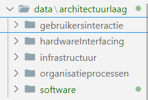

# Gebruik van Curriculum (Webcomponent)

Dit component is een webcomponent dat het huidige curriculum weergeeft van Hogeschool Windesheim. Het biedt een navigatie manier aan waarmee studenten door verschillende curriculumonderdelen kunnen bladeren en op een overzichtelijke manier toegang hebben tot relevante informatie.

## Integratie

1. **Importeer het component script**: Voeg het script voor het Curriculum Component toe aan je HTML-bestand met behulp van de `<script>` tag en het `type="module"` attribuut.

   ```html
   <script src="/components/curriculum-component.js" type="module"></script>
   ```

2. **Voeg het component toe aan je pagina**: Plaats de `<curriculum-component>` tag in het body-gedeelte van je HTML-bestand om het Curriculum Component op je webpagina weer te geven.

   ```html
   <curriculum-component></curriculum-component>
   ```

3. **Voeg de stylesheet toe**: Vergeet niet om de bijbehorende stylesheet toe te voegen aan je HTML-bestand om de juiste stijl toe te passen op het Curriculum Component.

   ```html
   <link rel="stylesheet" href="/css/style.css" s />
   ```

## Voorbeeld

Hieronder vind je een eenvoudig voorbeeld van een HTML-bestand met het Curriculum Component geïntegreerd:

```html
<!DOCTYPE html>
<html lang="nl">
  <head>
    <meta charset="UTF-8" />
    <meta name="viewport" content="width=device-width, initial-scale=1.0" />
    <script src="/components/curriculum-component.js" type="module"></script>
    <link rel="stylesheet" href="/css/style.css" />
    <title>Curriculum Navigatiebalk - Hogeschool Windesheim</title>
  </head>
  <body>
    <curriculum-component></curriculum-component>
  </body>
</html>
```

## Curriculum data toevoegen

Om nieuwe curriculuminformatie toe te voegen, volg je deze stappen:

1. **Definieer Curriculumdata:**
   Zorg ervoor dat je de juiste curriculumdata definieert die nodig zijn voor het aanpassen van het Curriculum Component. Dit helpt om de navigatiebalk correct te laten werken.

2. **Navigeer naar de Architectuurlagen:**
   Ga naar de map 'data/architectuurlagen'. Hier vind je de 5 architectuurlagen zoals beschreven in het hbo i model.

3. **Selecteer de Juiste Architectuurlaag:**
   Open de map van de relevante architectuurlaag waarin je curriculuminformatie wilt toevoegen.!

4. **Navigeer naar de SSDLc Fasen:**
   Binnen de geselecteerde architectuurlaag vind je een map genaamd 'ssdlc'. Open deze map.

5. **Voeg Curriculumdata Toe:**
   Binnen de 'ssdlc' map vind je mappen voor alle SSDLc fasen. Open de specifieke fase waarin je curriculuminformatie wilt toevoegen.

6. **Voeg HBO-I Activiteiten Toe:**
   Voor het toevoegen van curriculumdata binnen een SSDLc fase, voeg je HBO-I activiteiten toe.

7. **HBO-I Activiteit zonder Subvaardigheden:**

   ```javascript
   const curriculumData = [
     {
       naam: "HBO-I Realiseren",
       vaardigheden: [
         { naam: "Applicatie testen" },
         { naam: "Applicatie implementeren" },
       ],
     },
   ];
   ```

   - **HBO-I Activiteit met Subvaardigheden:**

     ```javascript
     const curriculumData = [
       {
         naam: "HBO-I Ontwerpen",
         vaardigheden: [
           {
             naam: "Ontwerp principes toepassen",
             vaardigheden: [
               { naam: "Toepassen van SOLID-principes" },
               { naam: "Gebruik van design patterns" },
             ],
           },
         ],
       },
     ];
     ```

   - **Meerdere HBO-I Activiteiten:**

     ```javascript
     const curriculumData = [
       {
         naam: "HBO-I Analyseren",
         vaardigheden: [
           { naam: "Requirements analyseren" },
           { naam: "Systeemarchitectuur evalueren" },
         ],
       },
       {
         naam: "HBO-I Ontwerpen",
         vaardigheden: [
           { naam: "Architectuur ontwerpen" },
           { naam: "Gebruikersinterface ontwerpen" },
         ],
       },
       {
         naam: "HBO-I Realiseren",
         vaardigheden: [
           { naam: "Applicatie ontwikkelen" },
           { naam: "Database modelleren" },
         ],
       },
     ];
     ```
